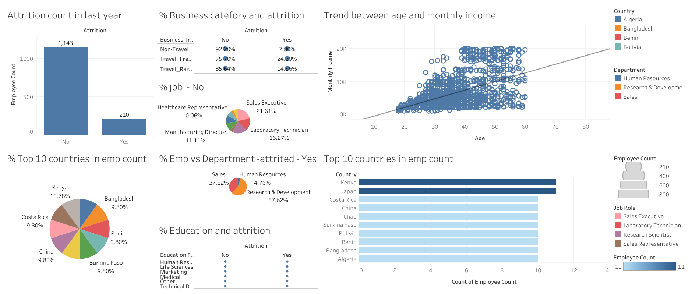

# Tableau Dashboard for Zomboville attrition report

A large company Zomboville is facing a lot of Attrition off-late. There HR department has compiled the data on Employees who have left the company (Attrition) in the last year. Please help them understand patterns in Attrition using the attached dataset.

- What is the number of people who have Attrited in the last year?

  -  210 People have attrited in the last year.

- What is the apprx percentage of employees in Research and Development Department?
  
   - 65.85

- Out of the Total Attrited Employees what percentage are from the Research and Development Department? 
  
  - 57.62

- What is the relation between Age and Monthly Income?
 
  - Uptrend

- In which job role have the most number of employees quit?
  
  - Laboratory Technician

- In terms of Percentage which Business Travel Category has faced the most Attrition? 
 
  - Travel_Frequently

- In terms of Percentage which Education Field has faced the most Attrition?
  
  - Human Resources

[Dashboard link here](https://public.tableau.com/views/hr_attrition_16981513216800/Dashboard1?:language=en-US&publish=yes&:display_count=n&:origin=viz_share_link)